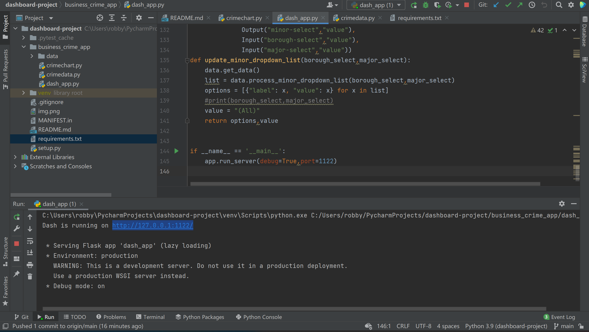
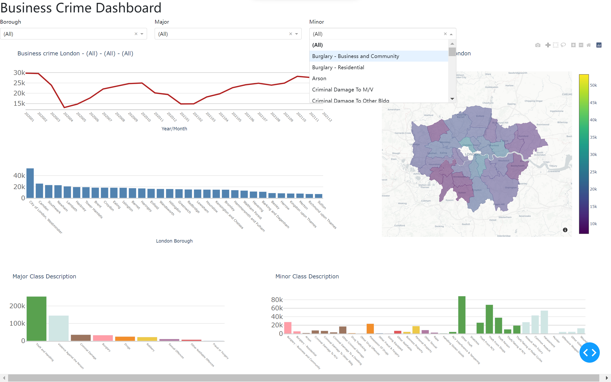

# business crime dashboard on flask app
The business crime dashboard is created display recent crime statistics in London in 2020-2021. The original crime data of these two years
was obtained from Metropolitan Police Service as a large and uncleaned single csv file. The dashboard was made by firstly cleaning and organize the data
in the csv file, then use the python version of plotly dash to create visualizations and interactivity within the dashboard. It gives users such as police officers,
students, or general citizen a clearer visual display of London crime trend, crime class difference and crime distribution compared to csv file. The dashboard is run as 
a flask app.

## Instructions to open the dashboard
Pycharm is preferred to clone and run the dashboard in this case.
Firstly, install all packages required in the file 'requirements.txt'. It can be done by typing the command below in the terminal
```python
pip install -r requirements.txt
```
Secondly, double-click the dash_app.py file in business crime app folder and go to the bottom
```python
if __name__ == '__main__':
    app.run_server(debug=True,port=1122)
```
run it and click the 'http://127.0.0.1:1122/'.

After clicking it, the effect should be like this:

